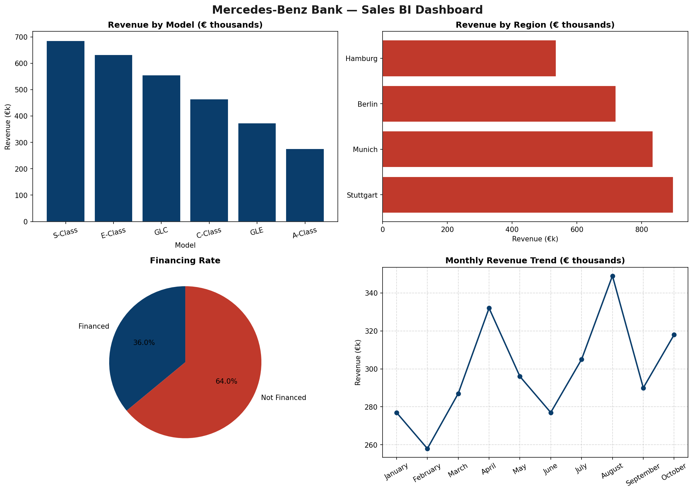

# Automotive Sales BI Dashboard 📊

A Business Intelligence dashboard analysing automotive sales data
using SQL and Python. Built to demonstrate core BI skills including
data modelling, SQL querying and KPI visualisation.

## What it does
- Creates and manages a SQL database (SQLite) from structured sales data
- Runs business intelligence queries to extract key KPIs
- Visualises insights in a clean 4-panel dashboard

## Key Insights Generated
- Revenue breakdown by car model and sales region
- Monthly revenue trend analysis
- Customer financing rate analysis
- Average price and units sold per model

## Dashboard Preview

## Tech Stack
- Python
- SQLite and SQL
- Pandas
- Matplotlib

## How to run
1. Clone this repo
2. Install dependencies: pip install pandas matplotlib
3. Run the notebook cell by cell
4. The SQL database is created automatically from the code

## Using Your Own Data
You can plug in your own dataset in two ways:

**Option 1: Use a CSV file**
- Place your CSV in the same folder as the notebook
- Change `use_own_data = False` to `use_own_data = True` in Cell 1
- Replace `your_file.csv` with your actual filename
- Your CSV should ideally have columns for: model, region,
  sale_price, financing, month

**Option 2: Use the built-in sample data**
- Just run the notebook as is
- Sample automotive sales data is generated automatically
